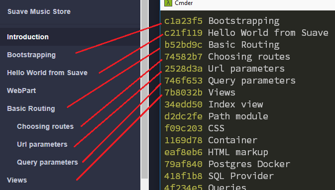

# Contribution Guidelines

Usually you'd find a single **master** / **main** branch for a repository.
This repository for the tutorial is exceptional, because there are 2 **completely separate** branches:

* First one, named [contents](https://github.com/theimowski/SuaveMusicStore/tree/contents) (where this contribution guideline is located) contains contents for the tutorial,
* Second one, prefixed with `src_v` contains source code for the tutorial and has a linear git history.

Thanks to the linear git history, one is able to track all the relevant changes in the tutorial to keep up to date.
Each commit from the source branch has a single-line commit message with a title for corresponding section in the tutorial.
Then the section can include code snippets from that commit.

Following is an illustration of the reference:



A section doesn't have to its corresponding commit (like Introduction or WebPart), but each commit must have its corresponding contents section.

## Building

As of now, the build process has been tested only on **Windows**.
To build (and preview in browser) the tutorial:

1. Create a copy of the repository - clone to a different directory (e.g. `c:\github\SuaveMusicStore_copy`)
1. In the repo copy checkout source branch `src_v..`
1. From the first repository invoke `build.cmd repo=c:\github\SuaveMusicStore_copy gen`
  * the `gen` parameter simply says to generate all sections
  * later while working on the tutorial it should be reloaded when a corresponding section file is saved, so you can skip the `gen` parameter to skip generating all sections (they will be then taken from filesystem)
1. For sections starting with SQL, you'll need the DB docker container working in background for the tooltips to be generated correctly.

## Generating snippets

F# snippets are not embedded in `content` branch.
They are cross-referenced from the `src` branch by applying an extra syntax.
Following are examples of the source cross referencing:

#### Whole file

```plain
==> App.fs
```

This snippet from `hello_world_from_suave.md` will be replaced with contents of `App.fs` file from `Hello World from Suave` commit in `src` branch

#### Fragment starting with

```
==> App.fs:`let html`
```

Take fragment from `App.fs` starting with `let html` text (ignore preceding spaces) up to a line where the indent-level is same as the starting line - in this case it will display whole `html` function from `App.fs`

#### Bounded fragment

```
==> App.fs:`let webPart`-`startWebServer`
```

The ending of snippet can be manipulated with optional end bound. Here the snippets ends on line starting with `startWebServer`

#### Line numbers

```
==> View.fs:20-53
```

Line numbers bound can also be used, however I prefer to limit those as each source update requires amending the hardcoded line numbers.

## If you'd like to contribute to:

### The contents of the tutorial

Please send pull request to the `contents` branch as you'd normally do.

### The source of the tutorial

Please send pull request to the most current branch prefixed with `src_v`. After the Pull reqest is accepted, I'll squash the merged commit to `contributions` section (at the end of tutorial) and force push the branch to refresh the source code.

If the `contributions` section grows too much, new [orphan](https://git-scm.com/docs/git-checkout#git-checkout---orphanltnewbranchgt) `srv_v` branch would be created.
It's also likely that the `src_v` branch might get rebased for a reason - keep that in mind when working on tutorial source.